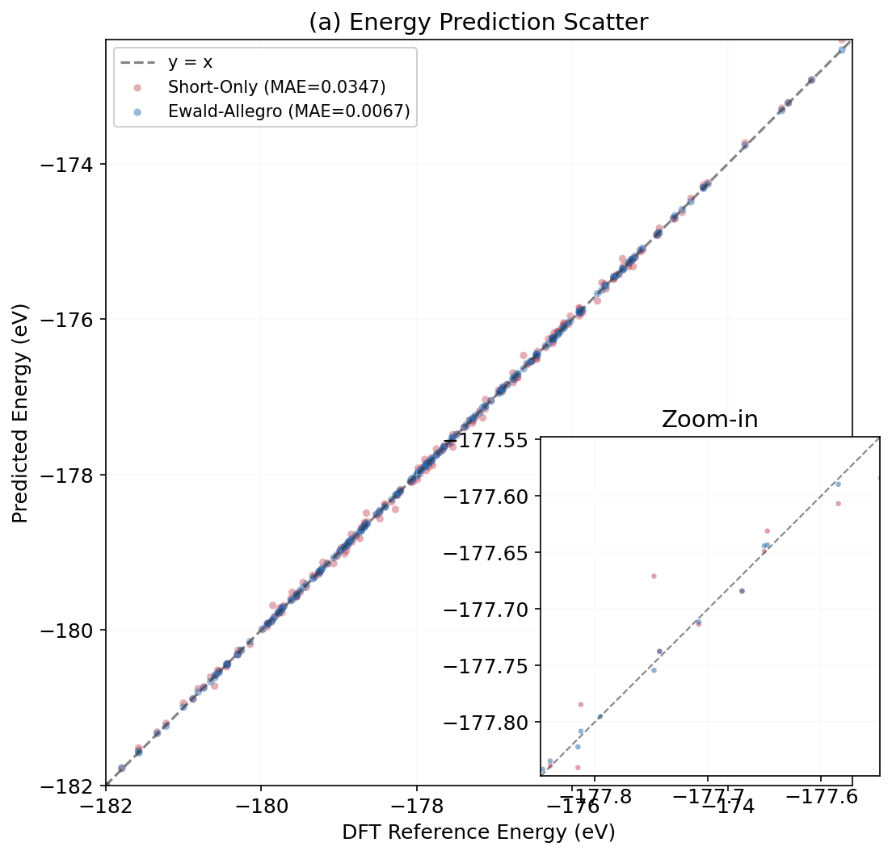
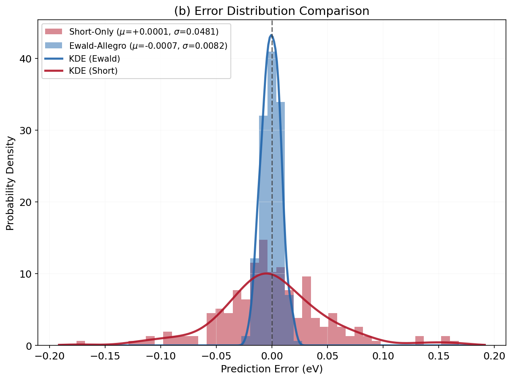
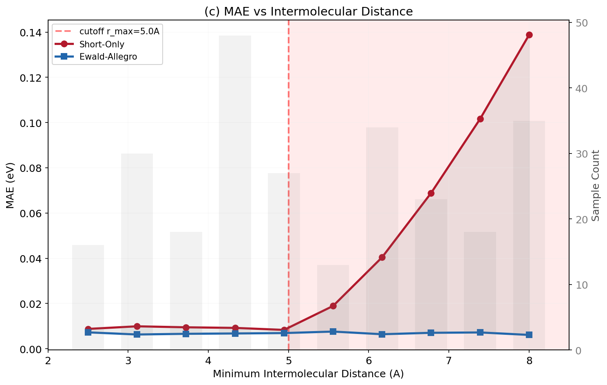

<p align="center">

</p>

<br/>

# Ewald-Allegro: Long-Range Electrostatic Interactions for Equivariant Neural Network Potentials

**Author: YiYuan Tao**

[](LICENSE)
[](https://www.python.org/)
[](https://github.com/xiaokang126/ewald-allegro)

---

## About

This project is an extension of [**mir-group/allegro**](https://github.com/mir-group/allegro.git) (MIT License, Harvard / NequIP Developers).
It augments the original Allegro E(3)-equivariant short-range interatomic potential with a **differentiable Ewald summation** to explicitly handle long-range electrostatic interactions.

> Original Allegro paper: *Learning local equivariant representations for large-scale atomistic dynamics*
> Musaelian et al., *Nature Communications* 14, 579 (2023)
> Source code: [https://github.com/mir-group/allegro](https://github.com/mir-group/allegro.git)

---

## Key Innovation

Traditional short-range equivariant potentials (including the original Allegro) only consider atomic interactions within a cutoff radius r_max. While this is adequate for covalent systems, it introduces systematic errors for **polar systems such as water and electrolytes** where long-range electrostatics are critical.

This project introduces:

1. **ChargePredictor** — Learns partial atomic charges from Allegro edge features via a learnable readout
2. **Differentiable Ewald Summation** — Computes long-range electrostatic energy analytically from predicted charges, with full gradient support for end-to-end training
3. **Joint Training** — Short-range and long-range terms optimized simultaneously

```
E_total = E_short(Allegro) + E_long(Ewald, charges) + shift
```

<br/>

| Energy prediction scatter | Error distribution (with KDE) | Key: distance-bucket MAE |
|---|---|---|
|  |  |  |

**Fig 1 (left):** Energy prediction scatter plot — Ewald-Allegro predictions vs. DFT reference energies. Tight clustering along the diagonal demonstrates high accuracy across the full energy range. **Fig 2 (center):** Error distribution histogram with Gaussian KDE overlay. **Fig 3 (right):** Intermolecular distance-bucket MAE — the key evidence showing that short-range-only errors grow at distances > r_max, while Ewald-Allegro errors remain flat.

---

## Results

On the water system (12 H₂O, 36 atoms) AIMD trajectory, `analyze.py` generates 6 detailed diagnostic figures (and a summary dashboard) demonstrating the improvement of Ewald-Allegro over short-range-only potentials:

| Diagnostic | Description |
|-----------|-------------|
| **Fig 1** — Prediction Scatter | Ewald-Allegro predictions vs. DFT reference energies |
| **Fig 2** — Error Distribution | Histogram of energy errors with Gaussian KDE overlay |
| **Fig 3** — Distance-Bucket MAE | Key evidence: short-range-only errors grow at distances > r_max, while Ewald-Allegro errors remain flat |
| **Fig 4** — Error vs. Long-Range | Correlation between prediction error and Ewald long-range contribution |
| **Fig 5** — Size Scaling | Per-atom MAE as a function of system size |
| **Fig 6** — Charge Analysis | Atomic charge distribution and electroneutrality check |

> **Note:** Model must be trained with `train.py` first. Running `analyze.py` will generate results based on the trained model; if no model is available, synthetic demo data is used to illustrate the expected behavior.

---

## Installation

### From Source

```bash
git clone https://github.com/xiaokang126/ewald-allegro.git
cd ewald-allegro

# Recommended: create a dedicated conda environment
conda create -n ewald-allegro python=3.10
conda activate ewald-allegro

# Install PyTorch (CUDA 12.1, see pytorch.org for other versions)
pip install torch torchvision torchaudio --index-url https://download.pytorch.org/whl/cu121

# Core dependencies
pip install e3nn nequip ase scipy matplotlib

# Install this package
pip install -e .
```

### Using the Install Script

```bash
bash install.sh
```

---

## Quick Start

```bash
# 1. Check dependencies
python prepare_data.py --check-deps

# 2. Test model forward + backward pass
python test_model_forward.py

# 3. Train a new model
python train.py

# 4. Analyze results (generates 6 figures in plot/)
python analyze.py
```

---

## Data Preparation

Three input modes are supported:

### 1. From VASP MD Output (Default)

Place VASP output directories (containing OUTCAR + XDATCAR) under `../unloaded_data/`:

```bash
python prepare_data.py
```

Auto-detects VASP runs, extracts energies, detects anomalies, outputs `data/train.xyz` and `data/test.xyz`.

### 2. Specify VASP Directory

```bash
python prepare_data.py --vasp-dir ../unloaded_data/hot3
```

### 3. From step_* Directory Format

For legacy step-based data:

```bash
python prepare_data.py --steps-dir ../vasp_steps_fixed
```

---

## Project Structure

```
ewald-allegro/
├── README.md                       ← This file
├── pyproject.toml                  ← Package configuration
├── LICENSE                         ← MIT License
├── .gitignore
├── install.sh                      ← One-click install script
│
├── allegro/                        ← Core code
│   ├── __init__.py
│   ├── model/
│   │   ├── ewald_allegro_v2.py     ← Ewald-Allegro main model
│   │   └── allegro_models.py       ← Upstream model registration
│   │
│   ├── ewald/                      ← Ewald module
│   │   ├── charge_predictor.py     ← Charge predictor network
│   │   ├── ewald_sum_optimized.py  ← Differentiable Ewald summation
│   │   └── cell_list.py            ← Cell list for neighbor search
│   │
│   ├── nn/                         ← Allegro neural network modules (upstream)
│   └── utils/                      ← Utility functions
│
├── scripts/
│   ├── train.py                    ← Training script
│   ├── prepare_data.py             ← Data preprocessing (+ --check-deps, --extract-steps)
│   ├── analyze.py                  ← Analysis script (6 figures)
│   └── test_model_forward.py       ← Model verification script
│
├── configs/
│   └── tutorial.yaml               ← Example configuration
│
├── examples/water/                 ← Minimal water example
│   ├── example.xyz                 ← 2 frames (~10KB)
│   └── run.sh                      ← Automated demo
│
├── docs/
│   ├── quickstart.md               ← Quick start guide
│   └── theory.md                   ← Theory (Ewald + architecture diagram)
│
└── tests/
    └── test_basic.py               ← Basic unit tests
```

---

## Citation

If this work is helpful in your research, please cite:

1. **Original Allegro Paper**
   > Albert Musaelian, Simon Batzner, Anders Johansson, Lixin Sun, Cameron J. Owen, Mordechai Kornbluth, and Boris Kozinsky.
   > "Learning local equivariant representations for large-scale atomistic dynamics."
   > *Nature Communications* 14, no. 1 (2023): 579

2. **Original NequIP Paper**
   > Simon Batzner, Albert Musaelian, Lixin Sun, Mario Geiger, Jonathan P. Mailoa, Mordechai Kornbluth, Nicola Molinari, Tess E. Smidt, and Boris Kozinsky.
   > "E(3)-equivariant graph neural networks for data-efficient and accurate interatomic potentials."
   > *Nature Communications* 13, no. 1 (2022): 2453

3. **This Project** (DOI to be updated)
   > YiYuan Tao. "Ewald-Allegro: Long-Range Electrostatic Interactions for Equivariant Neural Network Potentials."
   > GitHub: https://github.com/xiaokang126/ewald-allegro

---

## License

This project is open source under the MIT License.
- Upstream Allegro code: Copyright (c) 2022 The President and Fellows of Harvard College, Copyright (c) 2025 The NequIP Developers

See [LICENSE](LICENSE) for details.
